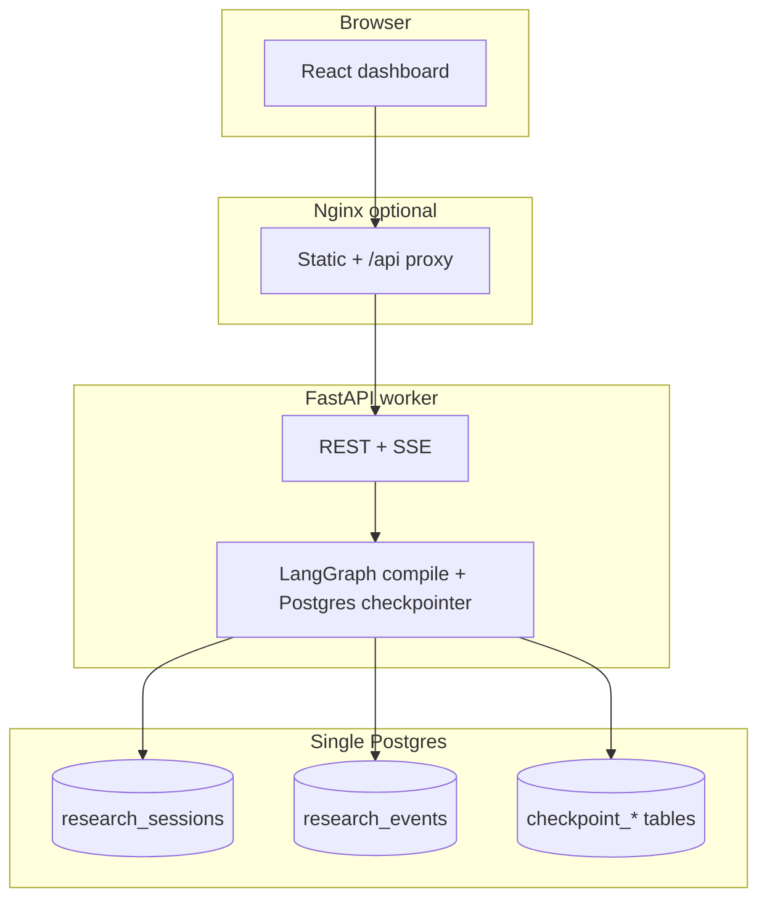

# Architecture

## Runtime overview

Deep dive of the backend pipeline (LangGraph nodes, trust math, tools, API): **[BACKEND.md](BACKEND.md)** and [backend/](backend/).

## Real-time UI

### Event contract

| `event_type` | When | `payload` highlights |
|--------------|------|----------------------|
| `agent_started` | Before each wrapped node | `agent_id`, `label`, `parent_id` |
| `agent_completed` | After node return / exception | `ok`, `updated_keys` or `error` |
| `tool_call` | After each search rail in a worker | `tool`, `args_summary`, `hits` |
| `claim_verified` | After trust scoring a claim | `claim_id`, `trust_score`, excerpt |
| `cost_update` | On LangGraph `values` stream ticks | `total_usd`, `invocations` |
| `session_status` | Terminal / SSE sentinel | `status`, optional `error` |

Events are **durable** in `research_events` (BIGSERIAL `id` monotonic per table). SSE (`GET /api/v1/research/{id}/stream?after_id=`) replays rows strictly after `after_id` and polls while the session is non-terminal — safe for multi-worker APIs at ~sub-second latency.

### Langfuse

LiteLLM registers `success_callback` / `failure_callback` = `["langfuse"]` when `LANGFUSE_PUBLIC_KEY` and `LANGFUSE_SECRET_KEY` are set (see `app/services/observability.py`). Traces are **per completion** as supported by the integration — node-level spans can be added later via explicit Langfuse decorators.

## Hardening & checkpoints

- **LiteLLM retries / timeout:** `litellm.num_retries` + `litellm.request_timeout` sourced from settings (`LITELLM_NUM_RETRIES`, `LITELLM_REQUEST_TIMEOUT`).
- **Checkpoint / resume:** `langgraph-checkpoint-postgres` stores graph state in the same Postgres instance as the product tables. Each session uses `configurable.thread_id = str(session_uuid)`. `POST /api/v1/research/{id}/resume` re-enters the graph with `stream_input=None`, continuing from the latest checkpoint when status is `failed` or `running`.
- **Eval harness:** `eval/run_eval.py` drives the public HTTP API and writes `results.jsonl`; swap the baseline stub for a real single-agent model to publish comparison tables.

## Failure modes

| Risk | Mitigation implemented |
|------|-------------------------|
| SSE disconnect | Client reconnects with last seen `id` (`after_id`). |
| Worker crash mid-graph | Checkpoint row + resume endpoint (same `thread_id`). |
| Streaming unsupported | Runner falls back to `ainvoke` with a warning log (still persists final state). |
