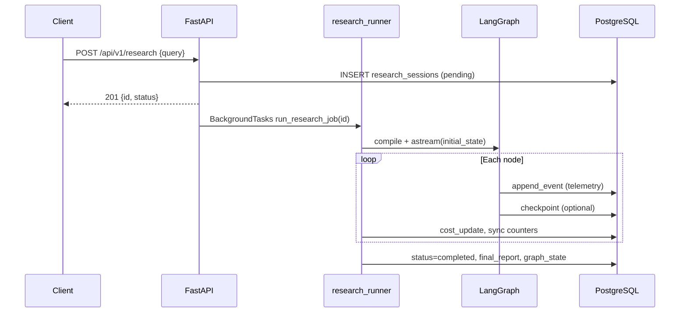

# Backend overview

## What the backend does

The backend answers a **natural-language research question** by:

1. **Planning** sub-questions and assigning search “rails” (web, academic, code).
2. **Retrieving** sources in parallel (bounded concurrency) and summarizing evidence per sub-question.
3. **Critiquing** coverage and optionally **looping** for another search wave.
4. **Extracting** structured claims tied to a **source catalog**.
5. **Fact-checking** each claim with an independent web search + verifier model.
6. **Scoring trust** on each claim from source metadata and the verifier score.
7. **Synthesizing** a Markdown brief, then **checking claim–source alignment** with text similarity.

All of this runs as one **LangGraph** workflow compiled in `backend/app/graph/build.py`, executed by `backend/app/services/research_runner.py`, exposed over **FastAPI** (`backend/app/main.py`, `backend/app/api/routes.py`), and persisted in **PostgreSQL** (sessions, events, LangGraph checkpoints).

## Technology stack

| Layer | Implementation |
|-------|----------------|
| HTTP API | FastAPI, CORS, `BackgroundTasks` for async jobs |
| Agent orchestration | LangGraph `StateGraph`, conditional edges, optional `AsyncPostgresSaver` |
| LLM access | LiteLLM `acompletion` (`chat_json`, `chat_text` in `app/services/llm.py`) |
| Search | Tavily / Serper (optional keys) or DuckDuckGo; arXiv API; GitHub-biased DDG |
| Embeddings / similarity | scikit-learn TF-IDF + cosine (default) or LiteLLM `aembedding` |
| Database | SQLAlchemy async + PostgreSQL (`research_sessions`, `research_events`, checkpoint tables) |
| Real-time UI feed | Server-Sent Events polling `research_events` |

## End-to-end sequence

## Configuration (high level)

Settings live in `app/config.py` and `.env`. Important groups:

- **Models:** `MODEL_STRONG`, `MODEL_FAST`, `OLLAMA_API_BASE`, `LITELLM_API_KEY`
- **Search:** `TAVILY_API_KEY`, `SERPER_API_KEY`
- **Limits:** `MAX_PARALLEL_AGENT_CALLS`, `MAX_TOOL_CALLS_PER_AGENT_INVOCATION`, `MAX_CRITIC_ROUNDS`, `MAX_SUB_QUESTIONS_PER_WAVE`, `SESSION_COST_LIMIT_USD`
- **Citation:** `SIMILARITY_MODE` (`tfidf` | `litellm`), `EMBEDDING_MODEL`, `CITATION_SIMILARITY_THRESHOLD`
- **SSE:** `SSE_POLL_INTERVAL_SECONDS`, `SSE_REPLAY_MAX_EVENTS`

Full variable names are documented in `docs/ENVIRONMENT.md` (if present) or inline in `Settings`.

## Figure: static graph layout

See [figures/research-graph-flow.svg](figures/research-graph-flow.svg) for a printable overview of node order and the critic loop.

## Code map

| Path | Role |
|------|------|
| `app/main.py` | FastAPI app, CORS, lifespan → LiteLLM/Langfuse setup |
| `app/api/routes.py` | REST + SSE |
| `app/graph/build.py` | Wires nodes and edges |
| `app/graph/nodes/*.py` | Planner, search, critic, router, postprocess |
| `app/schemas/state.py` | LangGraph state TypedDicts |
| `app/services/research_runner.py` | Streaming execution + DB updates |
| `app/services/trust.py` | Trust breakdown + headline score |
| `app/services/embeddings.py` | Claim–source similarity |
| `app/services/llm.py` | JSON / text chat wrappers |
| `app/tools/search.py`, `fetch.py`, `registry.py` | Retrieval + normalization |

Next: [02-state-and-data-models.md](02-state-and-data-models.md).
