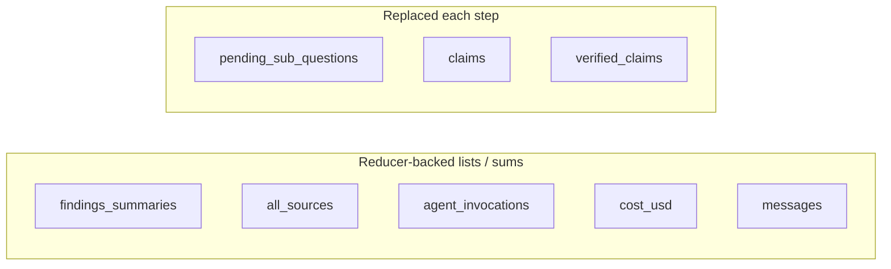

# State and data models

## LangGraph state: `ResearchGraphState`

The graph’s shared memory is `ResearchGraphState` in `backend/app/schemas/state.py`. It is a `TypedDict` (not a Pydantic model) because LangGraph uses it as the schema for reducers and node I/O.

### Field reference

| Field | Role | Merge behavior |
|-------|------|----------------|
| `session_id` | UUID string for DB + SSE | Required; set at start |
| `user_query` | Original question | Required |
| `plan` | Raw planner JSON (hypothesis tree, sub-questions, etc.) | Last write |
| `pending_sub_questions` | Queue for `parallel_search` | Replaced each wave / route prep |
| `findings_summaries` | One summary string per sub-question worker | **`operator.add`** (append) |
| `all_sources` | Flat list of `SourceDict` | **`operator.add`** (append) |
| `critic_round` | Integer loop counter | Last write / increment in router |
| `critic_followups` | Short strings from critic | Last write / cleared when queued |
| `claims` | Extracted `ClaimDict` list | Last write |
| `verified_claims` | Claims after fact-check + trust | Last write |
| `rejected_claims` | Reserved / future use | Last write |
| `draft_report` | Pre–citation-format Markdown | Last write |
| `final_report` | Published Markdown + review notes | Last write |
| `agent_invocations` | LLM/tool step counter (approx.) | **`operator.add`** |
| `cost_usd` | Estimated spend (USD) | **`add_cost`** reducer (sum) |
| `messages` | Human-readable log strings | **`operator.add`** |
| `stop_reason` | e.g. `budget` | Last write |

**Why reducers matter:** `findings_summaries`, `all_sources`, `agent_invocations`, `cost_usd`, and `messages` use accumulators so that parallel branches (or multiple partial updates) can append or sum safely without obliterating prior data.

### Nested TypedDicts

#### `SourceDict`

Normalized citation row from any search backend:

- `source_id` (required): stable id, e.g. `src_` + hash (`registry.stable_source_id`)
- `url`, `title`, `snippet`
- `full_content` (optional): from HTTP “browser lite” fetch
- `published_date` (optional): used in recency scoring
- `domain_authority` (optional float): provider hint; trust scoring also recomputes authority from URL
- `tool_name`: which rail produced the hit

#### `SubQuestionDict` / planner output shape

Planner-produced items are stored as dicts with:

- `id`, `text`, `status` (`pending` | `running` | `done`)
- `tools` or `assigned_tools`: list like `search_web`, `search_academic`, `search_code`

Nodes use `tools_for_subq()` in `_util.py` to read either key.

#### `ClaimDict`

- `id`, `claim`, `source_ids` (must be keys in the catalog)
- After verification: `trust_score` (0–100 int), `trust_breakdown` (per-dimension numbers), `fact_check_notes`, optional `flags` (e.g. `LOW_CITATION_ALIGNMENT`)

## API models (Pydantic)

`backend/app/schemas/api.py`:

- `ResearchCreateRequest`: `query` string (3–16k chars)
- `ResearchSessionResponse`: id, query, status, `total_cost_usd`, `agent_invocation_count`, timestamps
- `ResearchSessionDetailResponse`: above + `final_report`, `error_message`, `graph_state` (JSON snapshot)

These are **stable JSON** for the frontend and do not mirror the full LangGraph state (which is larger and includes intermediate lists).

## Database models (SQLAlchemy)

`backend/app/db/models.py`:

### `ResearchSession`

- `id` UUID PK
- `query`, `status` (`pending` | `running` | `completed` | `failed`)
- `graph_state` JSONB — last full state dict after success
- `final_report` text
- `error_message` text
- `total_cost_usd` `Numeric(12,6)`
- `agent_invocation_count` int
- `created_at`, `updated_at`

### `ResearchEvent`

Append-only SSE / audit log:

- `id` BIGSERIAL (monotonic; **SSE cursor**)
- `session_id` FK
- `event_type` string
- `payload` JSONB
- `created_at`

Event types include `run_config`, `agent_started`, `agent_completed`, `tool_call`, `claim_verified`, `cost_update`, `session_status`. See [ARCHITECTURE.md](../ARCHITECTURE.md).

### LangGraph checkpoints

The same PostgreSQL instance holds LangGraph checkpoint tables (created via `AsyncPostgresSaver.setup()`). The graph run uses `configurable.thread_id = str(session_uuid)` so resume is scoped per session.

## Initial state seed

`research_runner._initial_state()` zeros accumulators and lists:

- Empty `findings_summaries`, `all_sources`, `claims`, etc.
- `critic_round = 0`
- `agent_invocations = 0`, `cost_usd = 0.0`

Incoming node return values **merge** into this schema according to LangGraph rules and the reducers above.

Next: [03-langgraph-nodes.md](03-langgraph-nodes.md).
