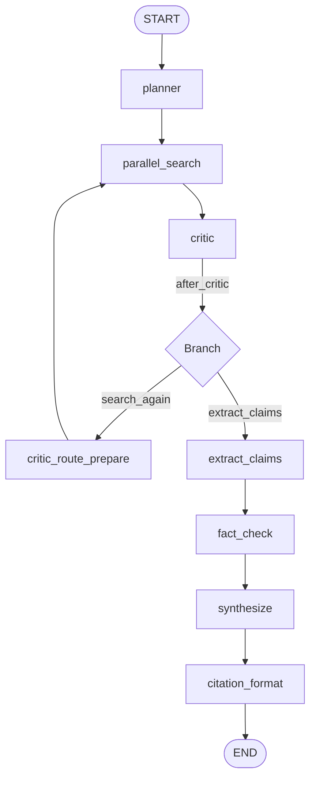
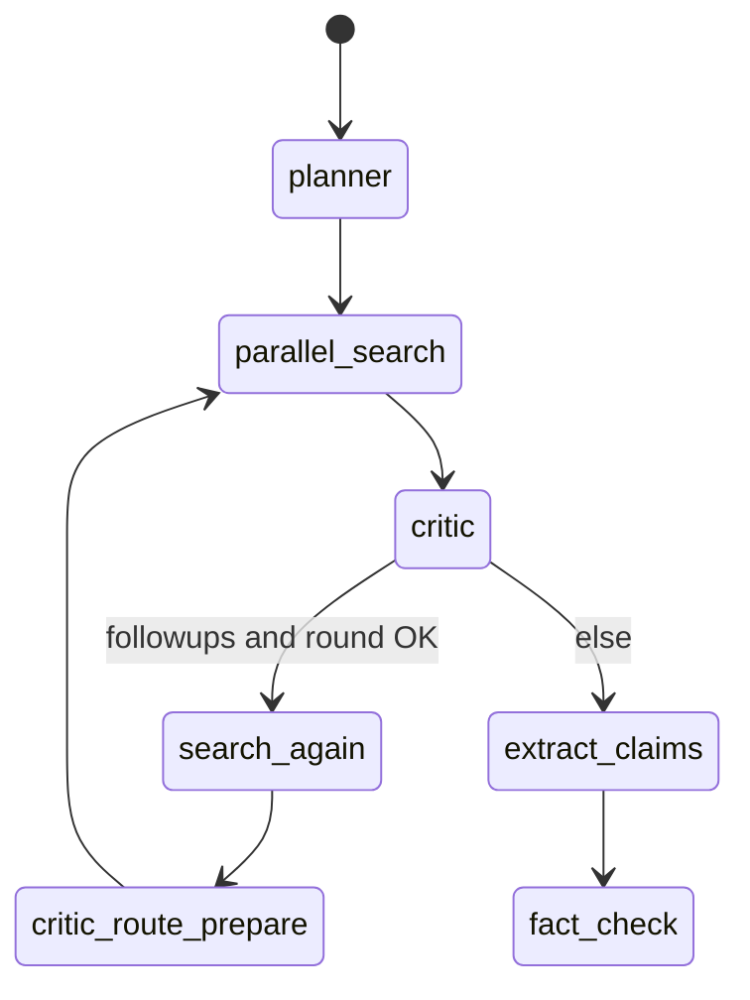

# LangGraph nodes (step-by-step)

Compiled graph: `compile_research_graph()` in `backend/app/graph/build.py`. Every node is wrapped by `wrap_node()` in `telemetry.py`, which emits `agent_started` / `agent_completed` on `research_events`.

## Full topology

Static SVG variant: [figures/research-graph-flow.svg](figures/research-graph-flow.svg).

---

## 1. `planner` — `planner_node`

**File:** `app/graph/nodes/planner.py`

**Purpose:** Turn `user_query` into a structured plan and a **wave** of `pending_sub_questions`.

**Behavior:**

1. If `budget_exceeded(state)` → return empty plan, `stop_reason: budget`.
2. Call `chat_json` with **`model_strong`**.
3. Expected JSON keys: `hypothesis_tree` (string), `sub_questions` (array of `{ text, tools }`).
4. `tools` must be subset of `search_web`, `search_academic`, `search_code`; default `["search_web"]` if missing.
5. Cap count with `max_sub_questions_per_wave`; assign UUID per sub-question; `status: pending`.
6. If model returns nothing usable, **fallback** single sub-question = full `user_query`.

**Outputs:** `plan`, `pending_sub_questions`, `agent_invocations` (+1), `cost_usd`, `messages`.

---

## 2. `parallel_search` — `parallel_search_node`

**File:** `app/graph/nodes/search.py`

**Purpose:** For **each** pending sub-question, run tools, optionally deep-fetch top URL, then summarize snippets with **`model_fast`**.

**Per sub-question (`_search_one_subq`):**

1. Resolve tool list via `tools_for_subq` (max 4 names).
2. Under `asyncio.Semaphore(max_parallel_agent_calls)`, for each tool until `max_tool_calls_per_agent_invocation`:
   - Call router: `search_web` → `unified_web_search`; `search_academic` → `arxiv_lite_search`; `search_code` → `github_hint_search`.
   - Append `SourceDict` rows; log `tool_call` event (hits count).
3. If budget of tool calls allows: **fetch first result URL** via `fetch_url_text`, store `full_content` (truncated) on first source.
4. Build bullet list of up to 8 snippets (titles, URLs, untrusted-wrapped excerpts).
5. `chat_text` with **`model_fast`**: 200–500 token summary; temperature 0.25.

**Wave outputs:**

- `pending_sub_questions: []` (**consumed**)
- `findings_summaries`: appended one string per subq
- `all_sources`: appended all sources (flat; duplicates possible across waves)
- Sum of costs / invocations across workers

**Isolation:** All workers share one LangGraph step but separate async tasks; Postgres session semantics stay simple.

---

## 3. `critic` — `critic_node`

**File:** `app/graph/nodes/critic.py`

**Purpose:** Quality gate — propose **follow-up** sub-questions if evidence is thin or contradictory.

**Behavior:**

1. Budget guard.
2. Join `findings_summaries` (truncated), wrap as untrusted web content for the prompt.
3. `chat_json` with **`model_strong`**: response `{ followups: string[], satisfied: boolean }` (only `followups` is read in code today).
4. Cap followups at 5.

**Outputs:** `critic_followups`, cost, invocations, message.

---

## 4. Routing: `after_critic` + `critic_route_prepare`

**File:** `app/graph/nodes/router.py`

**`after_critic(state)`** (synchronous conditional):

- If `critic_followups` is non-empty **and** `critic_round < max_critic_rounds` → return `"search_again"`.
- Else → `"extract_claims"`.

**`critic_route_prepare_node`** (runs only on `search_again` edge):

- Builds new `pending_sub_questions` from followups (capped by `max_sub_questions_per_wave`), each with `tools: ["search_web"]`.
- Increments `critic_round`.
- Clears `critic_followups` (avoids infinite loops).

**Design note:** LangGraph conditional edge functions cannot mutate state; hence the separate prepare node.

---

## 5. `extract_claims` — `extract_claims_node`

**File:** `app/graph/nodes/postprocess.py`

**Purpose:** Convert narrative findings into **structured claims** referencing only known `source_id` keys.

**Behavior:**

1. Build **source catalog** map `source_id → SourceDict` from `all_sources`; render catalog lines for the prompt.
2. `chat_json` **`model_strong`**: `{ claims: [{ id, claim, source_ids }] }`.
3. Filter: non-empty claim text; `source_ids` intersected with catalog (invalid ids dropped).
4. Cap at 30 claims.

**Outputs:** `claims`, cost, invocations.

---

## 6. `fact_check` — `fact_check_node`

**File:** `app/graph/nodes/postprocess.py`

**Purpose:** **Independent** verification per claim (parallel).

**Per claim (`_verify_one_claim`):**

1. `unified_web_search("verify: {claim}", session_id)` — fresh snippets.
2. `chat_json` **`model_fast`**: expect `{ supports, score, notes }`. **score** is a 0–100 float (default **50** on parse error).
3. `attach_trust_to_claim(claim, catalog, fc_score)` merges the verifier score into the headline trust (see [04-scoring-trust-and-similarity.md](04-scoring-trust-and-similarity.md)).
4. Emit `claim_verified` event with trust and source metadata.

**Outputs:** `verified_claims`, aggregated cost and invocations.

---

## 7. `synthesize` — `synthesizer_node`

**File:** `app/graph/nodes/postprocess.py`

**Purpose:** Narrative Markdown from **verified claims only**.

**Input formatting:** Each claim prefixed with trust band:

- `HIGH` if trust ≥ 81  
- `MODERATE` if ≥ 51  
- `LOW` otherwise  

Example line: `- (HIGH 90/100) claim text | sources: src_abc,src_def`

**Behavior:** `chat_text` **`model_strong`** with sections Summary / Findings / Caveats; inline cites as `[src_x]`.

**Outputs:** `draft_report`, cost, invocations.

---

## 8. `citation_format` — `citation_formatter_node`

**File:** `app/graph/nodes/postprocess.py`

**Purpose:** **Post-hoc alignment** — compare each claim text to cited source bodies (snippet or `full_content`).

For each cited source:

- \(\mathrm{sim}(\text{claim}, \text{basis}_s) \in [0,1]\).

Aggregate with the **minimum** (weakest link among citations):

\[
\text{worst} = \min_{s} \mathrm{sim}(\text{claim}, \text{basis}_s)
\]

If \(\text{worst} < \texttt{citation\_similarity\_threshold}\), append flag `LOW_CITATION_ALIGNMENT` and a Markdown review block.

**Outputs:** `final_report`, nominal `agent_invocations` +1, **no extra LLM cost** (similarity only).

---

## Budget guard (`budget_exceeded`)

**File:** `app/graph/nodes/_util.py`

- If `SESSION_COST_LIMIT_USD` is **≤ 0**, no budget cap is applied (unlimited for this check).
- If **> 0**, nodes early-exit when `cost_usd >= limit`.  
  Accumulated `cost_usd` comes from LiteLLM best-effort metadata (`_extract_cost_usd` in `llm.py`).

Next: [04-scoring-trust-and-similarity.md](04-scoring-trust-and-similarity.md).
