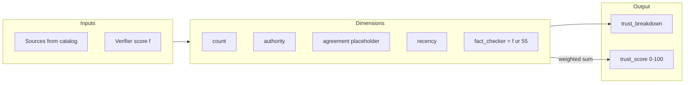

# Scoring: trust, fact-checking, and citation similarity

This document explains **numeric scoring** in the backend: headline **trust** on claims (0–100), the **verifier** score from the fact-check step, and **claim–source similarity** for citation review.

Implementation: `app/services/trust.py`, `app/graph/nodes/postprocess.py`, `app/services/embeddings.py`.

---

## 1. Fact-check verifier score (\(f\))

For each claim, `fact_check_node` runs a **fresh** `unified_web_search("verify: …")` and asks **`model_fast`** for JSON:

- `supports` (boolean; not used in trust math today)
- `score` — **\(f \in [0,100]\)** (missing or invalid → **50**)
- `notes` — free text stored as `fact_check_notes`

So \(f\) is a **model-assigned** confidence given new snippets, not a deterministic metric.

---

## 2. Trust breakdown dimensions

`compute_trust_breakdown(claim, sources, fact_checker_score)` in `trust.py` produces five interpretable components before mixing.

### 2.1 Source count (\(c_{\text{count}}\))

Let \(n = |\text{sources}|\) (claim’s resolved `source_ids` pointing at catalog entries).

- If \(n = 0\): handled in a **no-source branch** (see §4).
- Else:

\[
c_{\text{count}} = \min\bigl(100,\; 35 + 15 \cdot \max(0, n - 1)\bigr)
\]

Interpretation: base 35 for one source, +15 per additional supporting source, capped at 100.

### 2.2 Source authority (\(c_{\text{auth}}\))

Per-source **URL domain heuristic** `_domain_authority(url)` returns 0–100. The claim-level score is the **arithmetic mean** over attached sources:

\[
c_{\text{auth}} = \frac{1}{n} \sum_{i=1}^{n} A(\text{url}_i)
\]

| Heuristic pattern | Approx. score |
|-------------------|---------------|
| `.gov` / `.mil` | 95 |
| `.edu` | 88 |
| `wikipedia.org` | 85 |
| `github.com`, `arxiv.org` | 80 |
| generic `.org` | 65 |
| default | 55 |
| empty / parse error | 30 |

*(Values are engineering defaults, not a formal PageRank.)*

### 2.3 Source agreement (\(c_{\text{agree}}\))

Currently a **constant placeholder**:

\[
c_{\text{agree}} = 70
\]

Comment in code: future **NLI / entailment** models could replace this with measured agreement across snippets.

### 2.4 Recency (\(c_{\text{recency}}\))

For each source, `_recency_score(published_date)`:

- Missing date → **60** (neutral)
- Parse error → **60**
- Else parse ISO-like timestamp, compute age in days \(d\):

\[
c_{\text{rec},i} = \operatorname{clip}_{[20,100]}\Bigl(100 - \frac{d}{1825} \cdot 80\Bigr)
\]

So roughly: **100** at publication “now”, trending toward **20** at about **5 years** (\(1825\) days). Then:

\[
c_{\text{recency}} = \frac{1}{n} \sum_i c_{\text{rec},i}
\]

### 2.5 Fact-checker dimension (\(c_{\text{fc}}\))

Let \(f\) be the verifier score from §1.

- If **`f` is `None`**: use **55** as a neutral prior.
- Else: \(c_{\text{fc}} = f\).

---

## 3. Weighted trust (headline score)

Weights (fixed in code):

| Dimension | Weight \(w\) |
|-----------|----------------|
| `source_count` | 0.15 |
| `source_authority` | 0.25 |
| `source_agreement` | 0.15 |
| `recency` | 0.15 |
| `fact_checker` | 0.30 |

Continuous aggregate:

\[
T_{\text{raw}} = \sum_{k} w_k \, c_k
\]

**Published integer** (clamped):

\[
\text{trust\_score} = \operatorname{round}\bigl(\operatorname{clip}_{[0,100]}(T_{\text{raw}})\bigr)
\]

The breakdown dict on each claim stores the **component scores** \(c_k\) (not the weighted sum); `trust_score` is the headline.

---

## 4. Edge case: no supporting sources

If the claim lists no sources that resolve in the catalog (`n = 0`), the weighted blend is **not** used. The implementation returns:

- Component placeholders: `source_count` and `source_authority` at **0**, `source_agreement` and `recency` at **40**, `fact_checker` = \(f\) (or **0** if missing).
- Headline trust (integer):

\[
\text{trust\_score} = \operatorname{clip}_{[0,45]}\bigl(\operatorname{round}(0.45 \cdot f)\bigr)
\]

So unsourced claims stay **at or below 45** even when the verifier \(f\) is high; they are not treated as fully trustworthy without provenance.

---

## 5. Citation alignment similarity

After synthesis, `citation_formatter_node` checks whether each claim is **actually supported** by the cited passage (snippet or `full_content`).

### 5.1 Per–claim, per–source score

For source \(s\):

\[
\text{sim}_s = \mathrm{Similarity}(\text{claim}, \ \text{basis}_s)
\]

where `basis_s` is `full_content[:4000]` if present, else `snippet[:4000]`.

### 5.2 Aggregation: minimum across citations

\[
\text{worst} = \min_s \text{sim}_s
\]

If \(\text{worst} < \theta\) where \(\theta =\) `CITATION_SIMILARITY_THRESHOLD` (default **0.7**), the claim gets flag **`LOW_CITATION_ALIGNMENT`** and an explanatory block is appended to `final_report`.

Using **min** encodes a *weakest-link* requirement: every linked source should resemble the claim text under the metric.

### 5.3 Mode: TF–IDF + cosine (default)

`similarity_mode=tfidf` in settings:

1. Fit a `TfidfVectorizer` on \([\text{claim}, \text{basis}]\) (`max_features=256`, English stop words).
2. Let \(\vec{v}_a, \vec{v}_b\) be the two sparse rows.

\[
\text{sim} = \max\left(0, \min\left(1, \frac{\vec{v}_a \cdot \vec{v}_b}{\lVert \vec{v}_a \rVert \, \lVert \vec{v}_b \rVert}\right)\right)
\]

Empty strings → **0**. Vectorizer failures → **0**.

### 5.4 Mode: embeddings (LiteLLM)

`similarity_mode=litellm`:

1. `aembedding(model=embedding_model, input=[claim, basis])`.
2. Let \(\mathbf{e}_1, \mathbf{e}_2 \in \mathbb{R}^d\) be embeddings.

\[
\text{sim} = \max\left(0, \min\left(1, \frac{\mathbf{e}_1 \cdot \mathbf{e}_2}{\lVert \mathbf{e}_1 \rVert \, \lVert \mathbf{e}_2 \rVert}\right)\right)
\]

On API failure or short response, code **falls back** to the TF–IDF path.

---

## 6. Synthesizer trust bands (UX only)

`synthesizer_node` labels each line for the writer model — **not** stored as separate scores:

| Label | Condition on `trust_score` |
|-------|----------------------------|
| HIGH | ≥ 81 |
| MODERATE | ≥ 51 |
| LOW | < 51 |

These bands guide rhetoric (e.g. Caveats) but do not change `trust_score`.

Next: [05-tools-search-fetch.md](05-tools-search-fetch.md).
