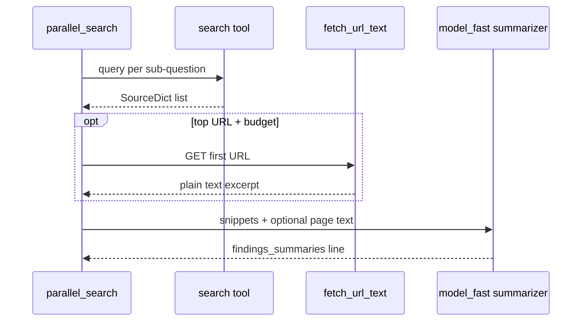

# Tools: search, fetch, and source normalization

## Design goal

The **planner** assigns **logical tool names** per sub-question. **Searcher workers** map those names to Python callables that return a **uniform list of `SourceDict`** records so downstream steps (catalog, trust, citations) stay provider-agnostic.

---

## Tool router (parallel search)

In `app/graph/nodes/search.py`, `_router()`:

| Planner tool | Function | Behavior |
|--------------|----------|----------|
| `search_web` | `unified_web_search` | Tiered web search (see below) |
| `search_academic` | `arxiv_lite_search` | arXiv Atom API; falls back to unified web if empty |
| `search_code` | `github_hint_search` | DuckDuckGo (or Tavily) with `site:github.com` bias; may fall back |

All return `list[SourceDict]`.

---

## Web search stack (`app/tools/search.py`)

**`unified_web_search`** priority:

1. **Tavily** if `TAVILY_API_KEY` is set → HTTP `api.tavily.com/search`.
2. Else **Serper** if `SERPER_API_KEY` → `google.serper.dev/search`.
3. Else **DuckDuckGo** via `duckduckgo-search` (no key; rate limits apply).

Raw rows are normalized through **`wrap_sources`** in `registry.py` with a `tool_name` label (`tavily` / `serper` / `duckduckgo`).

**`arxiv_lite_search`**: GET `export.arxiv.org/api/query` with `search_query=all:{query}`; parses Atom XML for title, link, summary, published.

**`github_hint_search`**: rewrites query to `{query} site:github.com`, then DuckDuckGo (or Tavily if configured).

---

## Source registry / IDs (`app/tools/registry.py`)

### `stable_source_id(url, title, session_id)`

\[
\text{id} = \texttt{src\_} \,||\, \text{SHA256}(\texttt{session\_id} \| \texttt{url} \| \texttt{title})_{:16\text{ hex}}
\]

Same URL+title in one session collides to the same id (helpful for dedup in UI).

### `wrap_sources(raw, tool_name, session_id)`

- Drops rows without URL.
- Truncates snippet to 2000 chars.
- Copies optional `full_content`, `published_date`, `domain_authority`.

---

## HTTP fetch (`app/tools/fetch.py`)

**`fetch_url_text(url)`** — “browser lite”:

- `httpx` GET with `User-Agent` and size cap `FETCH_MAX_BYTES`.
- Accepts `text/html` or `text/plain`.
- HTML: strip `script`/`style`, remove tags regex, normalize whitespace; cap extracted text length.

Used in **`parallel_search`** for the **top hit** only when tool-call budget allows, to enrich **citation similarity** with longer `full_content`.

---

## Untrusted content & truncation

- **`wrap_untrusted`**: fences web text in `<untrusted_web_content>` in prompts (`_util.py`).
- **`truncate_chars`**: symmetric head/tail cut for large findings (`planner`/`critic`/`extract_claims` use different caps).

These controls limit **prompt injection** surface and keep local LLM calls bounded.

---

## Event: `tool_call`

After each tool invocation in `_search_one_subq`, `append_event` records:

- `agent_id` (sub-question id), `parent_id: parallel_search`
- `tool`, `args_summary` (truncated query), `hits`

Downstream SSE dashboards can show retrieval activity wave-by-wave.

Next: [06-api-persistence-and-runner.md](06-api-persistence-and-runner.md).
