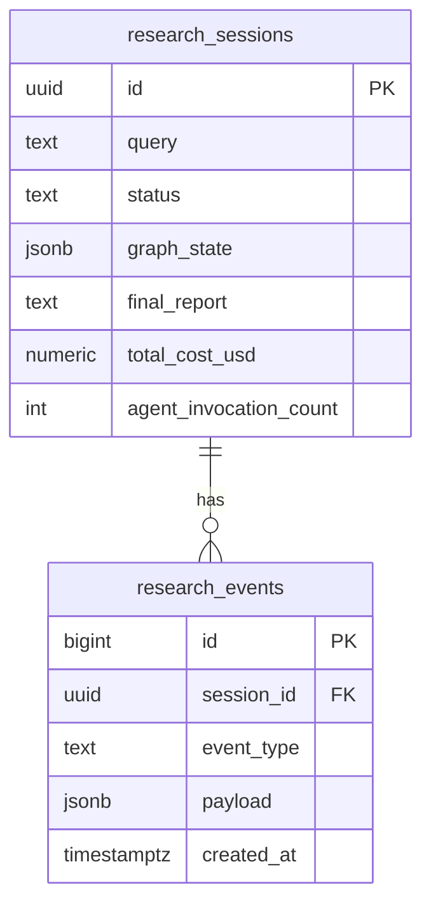

# API, persistence, and research runner

## FastAPI surface (`app/main.py`, `app/api/routes.py`)

| Method | Path | Purpose |
|--------|------|---------|
| GET | `/health` | Liveness: `{"status":"ok"}` |
| POST | `/api/v1/research` | Create session, enqueue `run_research_job` in `BackgroundTasks` |
| GET | `/api/v1/research/{session_id}` | Session detail: status, costs, `final_report`, `graph_state` |
| GET | `/api/v1/research/{session_id}/stream` | SSE stream of `research_events` |
| POST | `/api/v1/research/{session_id}/resume` | Resume from latest LangGraph checkpoint (`failed` or `running`) |

### Request / response models

Pydantic models in `app/schemas/api.py`:

- **Create:** `ResearchCreateRequest` with `query` (3–16000 chars).
- **Summary:** `ResearchSessionResponse` — poll-friendly.
- **Detail:** `ResearchSessionDetailResponse` — adds `final_report`, `error_message`, `graph_state`.

### CORS

`CORSMiddleware` allows comma-separated `CORS_ORIGINS` (Vite, nginx, etc.).

### Startup (lifespan)

`configure_litellm_runtime()` sets LiteLLM retries/timeouts and optional **Langfuse** callbacks when keys exist (`app/services/observability.py`).

---

## Research job execution (`app/services/research_runner.py`)

### Checkpointer

```text
AsyncPostgresSaver.from_conn_string(postgresql://...)
```

Connection string is derived from `DATABASE_URL` by stripping `+asyncpg` for LangGraph’s sync driver.

`checkpointer.setup()` ensures checkpoint tables exist.

### Thread identity

```python
config = {"configurable": {"thread_id": str(session_id)}}
```

Resume reuses the same `thread_id`, so `stream_input=None` continues from the last checkpoint.

### Initial LangGraph state

`_initial_state(session_id, query)` seeds:

- Empty accumulators: `findings_summaries`, `all_sources`, `messages`, etc.
- `critic_round = 0`, `cost_usd = 0.0`, `agent_invocations = 0`

### Streaming vs fallback

Primary path:

```python
async for state in graph.astream(stream_input, config, stream_mode="values"):
    ...
```

On stream failure, logs a warning and falls back to `graph.ainvoke(...)`.

### Progress sync

After each state tick (or on cost/invocation change):

- **`cost_update`** event → `append_event`
- **`_sync_session_progress_db`** → updates `ResearchSession.total_cost_usd` and `agent_invocation_count`

Terminal success:

- `status = completed`
- `final_report`, `graph_state` JSON, costs
- `session_status` event

Terminal failure:

- `status = failed`, `error_message`
- `session_status` with error payload

### `run_config` event

On non-resume starts, emits models and limits (`model_strong`, `model_fast`, `embedding_model`, `similarity_mode`, parallelism, cost limit) for reproducibility in the UI / audit log.

---

## SSE event delivery (`app/services/session_events.py`)

**`sse_event_stream(session_id, after_id, replay_limit)`**:

1. Loop: load session row; fetch events with `id > after_id` ordered ascending.
2. Yield `data: {json}\n\n` frames.
3. When session is `completed` or `failed`, after a short idle, emit final `session_status` and close.

Polling interval = `SSE_POLL_INTERVAL_SECONDS` (~350 ms by default).

**Reconnect semantics:** clients pass the last seen bigint `id` as `?after_id=` to avoid gaps.

---

## Database schema (product tables)

See `app/db/models.py` — summarized in [02-state-and-data-models.md](02-state-and-data-models.md).



---

## LLM layer (`app/services/llm.py`)

- **`chat_json`**: `acompletion` with optional `response_format=json_object` for OpenAI-style providers; Ollama skips that; strips markdown fences; parses JSON.
- **`chat_text`**: standard completion.
- Global **`asyncio.Semaphore`** from `max_parallel_agent_calls` caps concurrent completions.
- **`_extract_cost_usd`**: reads LiteLLM `response._hidden_params["response_cost"]` when present.

---

## Telemetry wrapper (`app/graph/telemetry.py`)

`wrap_node(agent_id, fn)` prepends `agent_started` and appends `agent_completed` (`ok`, `updated_keys` or `error`) so the **UI** can show a timeline aligned with LangGraph nodes even though several logical “agents” map to one process.

---

## Related reading

- [ARCHITECTURE.md](../ARCHITECTURE.md) — system diagram, SSE contract table, checkpoint failure modes
- [03-langgraph-nodes.md](03-langgraph-nodes.md) — per-node behavior
- [04-scoring-trust-and-similarity.md](04-scoring-trust-and-similarity.md) — trust + similarity math
